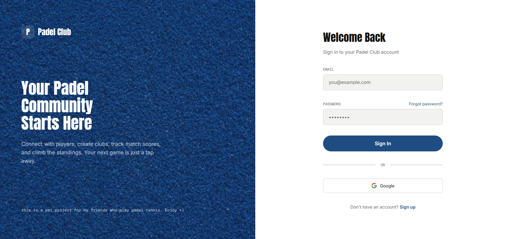
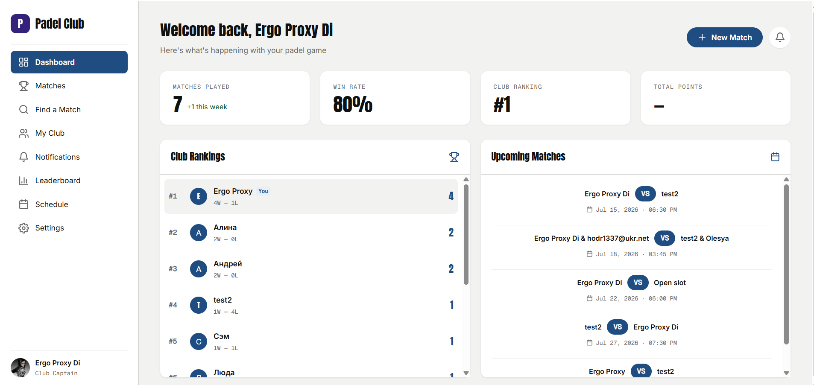
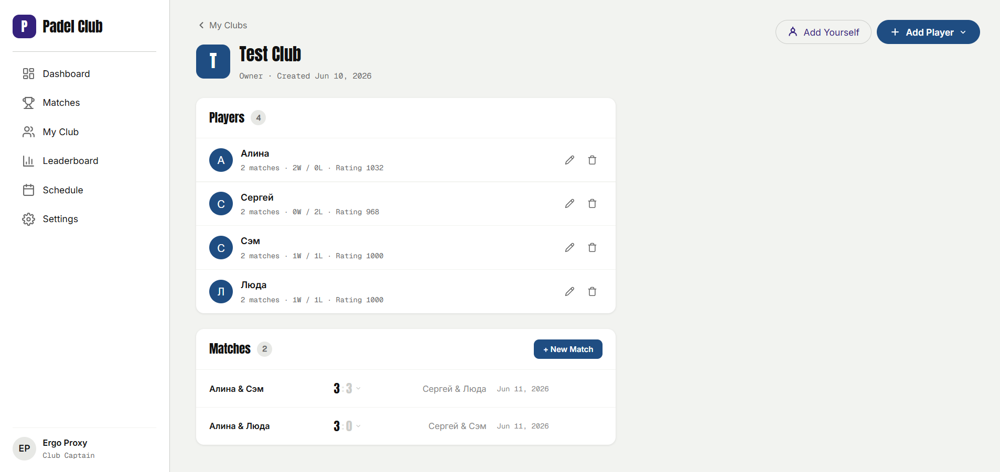
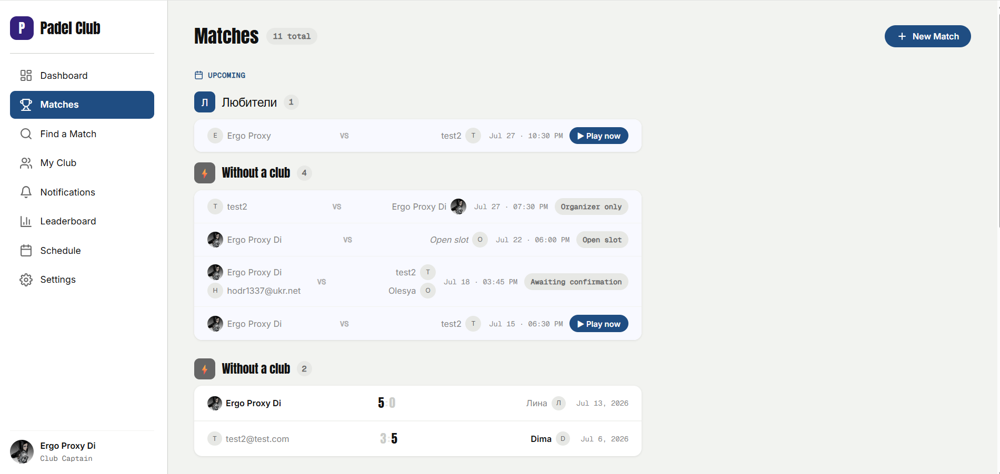

# Padel Score Tracker


A personal full-stack pet project for managing padel clubs, tracking match results, calculating player rankings, and organizing games.

The project is built with Vue 3, TypeScript, Pinia, and Firebase to demonstrate modern frontend architecture and cloud integration.

## Features

### Implemented

- Firebase Authentication (email/password + Google Sign-In), protected routes, session persistence
- Editable profile — display name, preferred padel side, avatar
- Club management — create clubs, roster of guest and registered players
- Match recording (1v1 / 2v2), multi-set scores, manual winner override
- Match scheduling, with a "Play now" flow to convert a scheduled match into a recorded one
- Elo rating system per club, recalculated automatically on match edit/delete
- Standalone matches without a club — play with existing registered users (searched site-wide) and/or unregistered guest players; registered participants also get a global rating tracked on their profile
- Find a Match — schedule a match with an open (unfilled) slot and let other users join it themselves
- Consent & notifications — inviting a registered user into a club or a scheduled match requires their approval. They get a notification (bell icon + Notifications page) and can accept or decline; declining a match invite frees up just that slot instead of cancelling the whole match
- Only the match's creator can start ("Play now") a scheduled match
- Dashboard with stats, Club Rankings and Upcoming Matches panels
- Real-time data throughout — clubs, rosters, matches, and notifications update live via Firestore listeners, no manual refresh needed
- Per-player avatars (photo or initial) across match cards, with per-player invite-status badges

### Planned

- Global (cross-club) leaderboards

## Tech Stack

| Layer            | Technology                         |
| ---------------- | ---------------------------------- |
| Framework        | Vue 3                              |
| Component API    | Composition API (`<script setup>`) |
| Language         | TypeScript                         |
| State Management | Pinia                              |
| Routing          | Vue Router 5                       |
| Backend Services | Firebase                           |
| Database         | Cloud Firestore                    |
| Authentication   | Firebase Authentication            |
| Build Tooling    | Vite                               |
| Deployment       | Firebase Hosting                   |

## Project Structure

```
src
├── assets/                 # Static assets and global styles
├── components/             # Shared components
│   ├── club/
│   ├── dashboard/
│   ├── layout/
│   ├── matches/
│   ├── myclub/
│   ├── quickmatch/
│   └── shared/              # Cross-cutting UI (PlayerAvatar, TeamRoster)
├── firebase/
│   └── index.ts            # Firebase configuration and initialization
├── router/
│   └── index.ts            # Application routes and route guards
├── stores/
│   ├── auth.ts             # Authentication state
│   ├── clubs.ts            # Club state (live subscription)
│   ├── matches.ts          # Match state (live subscription)
│   ├── players.ts          # Player/roster state (live subscription)
│   ├── notifications.ts    # Invite/notification state (live subscription)
│   ├── users.ts            # Site-wide user profile cache (live subscription)
│   └── index.ts            # Pinia instance
├── views/
│   ├── LoginView.vue
│   ├── RegisterView.vue
│   ├── ForgotPasswordView.vue
│   ├── DashboardView.vue
│   ├── MyClubView.vue
│   ├── ClubView.vue
│   ├── MatchesView.vue
│   ├── QuickMatchView.vue
│   ├── FindMatchView.vue
│   ├── NotificationsView.vue
│   └── SettingsView.vue
├── App.vue                 # Hosts app-wide real-time subscriptions
└── main.ts
```

## Architecture

The application follows a modular Vue 3 architecture:

- **Views** contain route-level pages.
- **Components** contain reusable UI building blocks.
- **Stores** manage global application state using Pinia.
- **Firebase** Firebase provides authentication and Firestore services.
- **Router** manages navigation and protected routes.
- **Real-time sync** — stores subscribe to Firestore via `onSnapshot` instead of one-off reads. Data shared across the whole app (clubs, notifications, the user profile cache) is subscribed once per session in `App.vue`; page-specific data (a club's roster, a match list) subscribes on mount and unsubscribes on unmount.

## Screenshots

| Login                            | Dashboard                        |
| -------------------------------- | -------------------------------- |
|  |  |

| My Club                      | Matches                        |
| ---------------------------- | ------------------------------ |
|  |  |

## Live Demo

[Open application](https://padel-club-score.web.app)

## Getting Started

### Prerequisites

- Node.js `^20.19.0` or `>=22.12.0`
- A Firebase project with Firestore and Authentication enabled

### Installation

```bash
# 1. Clone the repo
git clone https://github.com/DianaSicevaia/padel-score.git
cd padel-score

# 2. Install dependencies
npm install

# 3. Set up environment variables
cp .env.example .env
# Fill in your Firebase config values in .env

# 4. Start the dev server
npm run dev
```

### Environment Variables

Copy `.env.example` to `.env` and fill in your Firebase project credentials:

```
VITE_FIREBASE_API_KEY=
VITE_FIREBASE_AUTH_DOMAIN=
VITE_FIREBASE_PROJECT_ID=
VITE_FIREBASE_STORAGE_BUCKET=
VITE_FIREBASE_MESSAGING_SENDER_ID=
VITE_FIREBASE_APP_ID=
VITE_FIREBASE_MEASUREMENT_ID=
```

You can find these values in your Firebase project settings under **Project Settings → General → Your apps**.

### Scripts

```bash
npm run dev          # Start dev server
npm run build        # Type-check + production build
npm run preview      # Preview production build locally
npm run test:unit    # Run unit tests
npm run lint         # Run ESLint + oxlint
npm run format       # Format with Prettier
npm run deploy       # Build + deploy to Firebase Hosting
```

## License

MIT © Diana Sicevaia
